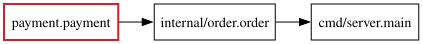

<h1 align="center">ripples</h1>

<p align="center">
  <strong>Find the Go packages affected by a Git change.</strong>
</p>

<p align="center">
  <a href="https://github.com/jimyag/ripples/actions/workflows/check.yaml"></a>
  <a href="https://github.com/jimyag/ripples/actions/workflows/release.yaml"></a>
</p>

<p align="center">
  <a href="#installation">Installation</a> ·
  <a href="#quick-start">Quick Start</a> ·
  <a href="#impact-graph">Impact Graph</a> ·
  <a href="#documentation">Documentation</a>
</p>

<p align="center">
  <a href="./README.md">简体中文</a> · <strong>English</strong>
</p>

---

ripples uses the Go AST, type information, and a declaration dependency graph to find Go packages that are directly or transitively affected between two Git revisions. It follows actual references to changed declarations instead of returning every package that imports a changed package.

The stable output is `<module-relative path>.<package name>`:

```text
cmd/server.main
internal/order.order
payment.payment
```

CI workflows can map package output to binaries, services, build jobs, labels, or deployment units.

## Core Capabilities

- **Declaration-level analysis**: detects added, removed, and modified functions, methods, types, fields, variables, constants, and `init` functions.
- **Direct and transitive propagation**: walks actual declaration references and call relationships in reverse.
- **Interface implementation resolution**: resolves concrete implementations from call sites and value flow without mixing unrelated implementations.
- **Common Go syntax coverage**: follows function values, closures, containers, type assertions, generics, `go`, `defer`, and initialization relationships.
- **Build input awareness**: detects effective changes to build tags, CGo, `//go:` directives, `go:embed`, `go.mod`, and `go.work`.
- **CI-friendly output**: emits stable sorted results with persistent caching, JSON, summaries, and DOT graphs.

See [Analysis](docs/analysis.en.md) for the complete coverage and static-analysis boundaries.

## Installation

Install the latest version with Go:

```bash
go install github.com/jimyag/ripples@latest
ripples --version
```

You can also download raw amd64 and arm64 binaries for Linux, macOS, and Windows from [GitHub Releases](https://github.com/jimyag/ripples/releases/latest).

Analyzing a target project still requires `git`, a compatible Go toolchain, and a Go module where `go list ./...` succeeds. See [Installation and Usage](docs/usage.en.md) for platform download commands and complete runtime requirements.

## Quick Start

Analyze the latest commit:

```bash
ripples -repo . -old HEAD~1 -new HEAD
```

Example output:

```text
cmd/server.main
internal/order.order
payment.payment
```

`-repo` points to the Go module being analyzed and may be a repository root or a module subdirectory inside a monorepo. `-old` and `-new` must resolve to commits. ripples analyzes committed Git trees and does not include uncommitted working tree changes.

See [Installation and Usage](docs/usage.en.md) for options, output formats, and cache configuration.

## Impact Graph

Emit a reverse package graph with `dot`, then convert it to SVG with Graphviz:

```bash
ripples -repo . -old HEAD~1 -new HEAD -output dot > impact.dot
dot -Tsvg impact.dot -o impact.svg
```

A red border marks a package containing changed declarations. Arrows point to packages that use it:



[View the DOT source](docs/impact-example.dot)

## Documentation

| Document | Contents |
| --- | --- |
| [Installation and Usage](docs/usage.en.md) | Installation, CLI options, output formats, DOT, and caching |
| [Analysis](docs/analysis.en.md) | Analysis model, supported Go usage patterns, and explicit boundaries |
| [GitHub Actions](docs/ci.en.md) | Release download, checksum verification, caching, and downstream job mapping |

## Development

```bash
task deps
task ci
```

`task lint` uses golangci-lint to check every Go package and test file. Run `task --list-all` for other common tasks. Local builds are written to `bin/ripples`.

## Release

Pushing a `v*` tag runs GoReleaser and uploads raw platform binaries plus `checksums.txt` without tar or zip archives. Run `task release-snapshot` before publishing to validate the configuration and local artifacts.

## License

This project is licensed under the [GNU General Public License v3.0](LICENSE).
