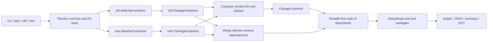

# Architecture

[简体中文](architecture.md) · [English](architecture.en.md)

This document describes how package impact analysis maps to the current ripples source code. See [Analysis](analysis.en.md) for user-facing coverage and boundaries, and [Installation and Usage](usage.en.md) for the CLI, output, and cache locations.

## End-to-End Flow



The entry point is [`main.go`](../main.go). The CLI creates the persistent cache and an `impact.Analyzer`, calls `AnalyzeDetailed`, and delegates formatting to [`internal/output/reporter.go`](../internal/output/reporter.go).

## 1. Revisions and Isolated Snapshots

[`internal/snapshot/source.go`](../internal/snapshot/source.go) turns user input into immutable analysis sources:

1. `Resolve` uses `git rev-parse --verify` to resolve both the commit and tree.
2. It records the module directory relative to the Git root and rejects paths outside the repository.
3. `OpenRevision` creates a detached worktree under a temporary directory without switching or modifying the user's working tree.
4. The worktree preserves the complete repository-relative layout, so same-repository local `replace` targets remain available.
5. `Source.Close` removes the worktree and temporary directory, and cleanup failures are returned to the caller.

Old and new revisions can be resolved and loaded concurrently. Git worktree metadata operations are serialized by a mutex keyed by Git root, preventing concurrent `worktree add/remove` calls in the same repository from interfering with each other. If old and new resolve to the same Git tree, ripples builds only one package snapshot.

## 2. PackageSnapshot

The core data structures are defined in [`internal/impact/snapshot.go`](../internal/impact/snapshot.go):

| Type | Purpose |
| --- | --- |
| `PackageSnapshot` | Module, package, and declaration graph for one Git tree |
| `Package` | Package path, name, content hash, and imports |
| `Symbol` | Stable declaration ID, semantic hash, package path, and dependency IDs |

`buildPackageSnapshot` loads `./...` through `golang.org/x/tools/go/packages`. It requests files, ASTs, types, type information, imports, module metadata, embed files, and other compiler inputs needed by the current build, but does not request `NeedDeps`. As a result:

- Every local package in the current module has full AST and type information.
- Standard-library and third-party packages remain type/import contracts; their function bodies are not traversed.
- `GOOS`, `GOARCH`, build tags, CGo, and the current Go toolchain decide which compiled files enter the analysis.
- `_test.go` files do not enter this package graph by default.

The parser retains comments for compiler directives and `go:embed`, while skipping legacy parser object resolution. After type checking, maps in `types.Info` that are no longer needed are cleared to reduce memory retained during snapshot construction.

## 3. Symbol IDs, Hashes, and Dependencies

The declaration graph is implemented primarily in [`internal/impact/symbol.go`](../internal/impact/symbol.go). Each local declaration receives a stable ID, for example:

```text
example.com/app/payment::func::Charge
example.com/app/payment::method::Service.Pay
example.com/app/payment::type::Config
example.com/app/payment::field::Config.Client
example.com/app/payment::interface-method::Store.Save
example.com/app/payment::var::DefaultClient
example.com/app/payment::const::RetryLimit
example.com/app/payment::init::payment/init.go::0
```

Regular identities contain the package path, declaration kind, and name. Methods include the receiver; `init` functions use the file path and index within that file. Synthetic dispatch symbols created by interface and value-flow analysis also contain the package path and a hash of the dependency set so unrelated old/new call chains cannot be joined accidentally.

### Semantic Hashes

- Go declarations are hashed through `ast.Fprint`.
- Source positions, ordinary comments, and parser-internal object links are filtered out, so formatting-only changes and edits to ordinary comments do not change declaration hashes.
- Constants are hashed from their complete type and exact value.
- Struct fields and interface methods are separate symbols, preventing one member change from contaminating every user of the enclosing type.
- CGo preambles and build-affecting `//go:` directives are normalized and added by [`internal/impact/buildmeta.go`](../internal/impact/buildmeta.go).
- Files matched by `go:embed` become independent content-hash symbols in [`internal/impact/embed.go`](../internal/impact/embed.go) and are connected to their variables.
- Package hashes also include compiled files, embed/other files, and imports to detect package-local content changes. Reordering declarations or moving them across files may still include the changed package itself, but does not invent cross-package declaration dependencies.

### Declaration Dependencies

Base dependencies come from `types.Info.Uses`: objects referenced by a declaration AST are converted to local symbol IDs. Three groups of Go semantics are then added:

1. Package initialization: effectful global initializers, `init` functions, and local import initialization order.
2. Embed/build inputs: embedded files, CGo preambles, and compiler directives.
3. Interfaces and function values: synthetic dispatch symbols produced by call sites, parameters, returns, fields, containers, and function-value propagation.

Dependencies are stored as sorted ID sets so snapshots, cache entries, and output remain stable under concurrent execution.

## 4. Interface and Function-Value Precision

Interface and value-flow behavior is centered on `valueFlowResolver` and `interfaceCallTracer` in [`internal/impact/symbol.go`](../internal/impact/symbol.go).

The analyzer follows:

- Concrete types held by interface parameters, returns, variables, and struct fields.
- Factories, multiple returns, assignments, type assertions, and type switches.
- Closures, named functions, function conversions, method values, and method expressions.
- Slices, arrays, maps, channels, ranges, `append`, and statically known indexes or keys.
- Generic forwarding, variadic arguments, `go`, and `defer` calls.

The key constraint is that resolution is based on call sites and value flow. If an interface has multiple implementations, changing implementation A does not include callers of implementation B merely because both types satisfy the same interface. When one static storage location genuinely may hold multiple runtime values, every candidate is conservatively included.

Resolution sets and stable candidate keys stop recursive functions, cyclic containers, and mutually recursive calls from creating infinite recursion. Third-party function bodies are not analyzed; when a local value is passed to a third-party interface, propagation follows only the visible interface method contract.

## 5. Module and Build-Configuration Changes

The package snapshot first hashes `go.mod`, `go.sum`, `go.work`, and `go.work.sum` as a group. Only when this hash differs between old and new does [`internal/impact/module.go`](../internal/impact/module.go) build additional module snapshots.

The module snapshot uses `NeedDeps`, but only to collect mappings from local packages to third-party module identities and checksum keys; it still does not parse third-party function bodies. It compares:

- Effective global configuration such as module path, Go version, toolchain, and `godebug`.
- Module paths, versions, and `replace` targets transitively used by each local package.
- Checksum values for the same module/version key when that key exists in both revisions.

Changed local packages are injected into the declaration graph through their package-init symbols and then use the same reverse-propagation algorithm. Adding or removing ordinary `go.sum` cache entries does not broaden the impact set.

## 6. Old/New Comparison and Reverse Propagation

The main algorithm is in [`internal/impact/analyzer.go`](../internal/impact/analyzer.go):

1. `changedSymbols` takes the union of old and new symbol IDs.
2. An ID present on only one side is added or removed; a differing hash is modified.
3. Synthetic dispatch symbols are not direct change roots; they carry precision within propagation paths.
4. `reverseDependencies` merges local declaration edges from old and new, reversing them from dependency to dependent.
5. `transitiveDependents` performs one breadth-first traversal from all changed roots.
6. The `affected` set deduplicates results and ensures that converging changes visit a declaration only once.
7. Symbols are collapsed into packages and sorted by relative path, package name, and full path.

Merging both graphs is what makes additions and removals correct: removals use call edges that still exist in the old graph, while additions use edges from the new graph. Reading only the current working tree or only one snapshot would lose relationships from the other side.

`AnalyzeDetailed` also collapses declaration edges into package edges for DOT output. Edges internal to one package are not rendered in the package graph.

## 7. Cache

[`internal/snapshot/cache.go`](../internal/snapshot/cache.go) implements a content-addressed JSON cache with two namespaces:

```text
package-snapshots/<key>.json
module-snapshots/<key>.json
```

Analysis keys contain:

- The analysis format version and graph kind.
- Git tree and module directory relative to the repository.
- Go runtime version.
- `GOOS`, `GOARCH`, `CGO_ENABLED`, `GOFLAGS`, and `GOEXPERIMENT`.

A cache hit avoids creating a worktree. A corrupt or unreadable entry falls back to rebuilding; a write failure is returned so the caller does not mistake an unpersisted result for a successful cache write. Entries are written to temporary files and atomically committed with rename.

Changes to the snapshot schema or analysis semantics must increment `analysisVersion`; changes to the generic cache encoding must increment `cacheVersion`.

## 8. Concurrency and Memory Boundaries

[`internal/impact/concurrency.go`](../internal/impact/concurrency.go) implements `parallelFor` with at most `GOMAXPROCS` workers. Errors are stored by input index so concurrency does not change diagnostic ordering. It is used for:

- Old/new revision resolution and module snapshot loading.
- Package summary calculation.
- Declaration hashing and base dependency calculation.

Old and new package snapshots are also loaded concurrently. Each package and declaration is summarized once per snapshot. The propagation phase uses one shared `affected` set, so multiple changes converging on one declaration do not traverse that declaration repeatedly.

Memory is bounded in three main ways: the primary package graph does not request third-party `NeedDeps`, unused `types.Info` maps are cleared after type checking, and completed snapshots persist package/symbol summaries rather than full ASTs. Snapshot construction still holds AST and required type information for the current module; this is the main memory cost of a cold analysis.

## 9. Output Layer

[`internal/output/reporter.go`](../internal/output/reporter.go) does not calculate impact; it only consumes `Analysis`:

- `simple`: one `<relative path>.<package name>` per line.
- `json`: relative path and package name only.
- `text` / `summary`: count and package list.
- `dot`: a package-level reverse relationship graph generated through `github.com/emicklei/dot`.

Mappings to binaries, services, labels, and deployment units remain outside the core analyzer and can be layered on the stable package output.

## 10. Code and Test Map

| Concern | Implementation | Main tests |
| --- | --- | --- |
| Revision/worktree | [`internal/snapshot/source.go`](../internal/snapshot/source.go) | [`internal/snapshot/source_test.go`](../internal/snapshot/source_test.go) |
| Persistent cache | [`internal/snapshot/cache.go`](../internal/snapshot/cache.go) | [`internal/snapshot/cache_test.go`](../internal/snapshot/cache_test.go) |
| Package snapshot/hash | [`internal/impact/snapshot.go`](../internal/impact/snapshot.go) | [`internal/impact/snapshot_test.go`](../internal/impact/snapshot_test.go) |
| Symbols, interfaces, and value flow | [`internal/impact/symbol.go`](../internal/impact/symbol.go) | [`internal/impact/analyzer_test.go`](../internal/impact/analyzer_test.go), [`internal/impact/interface_flow_test.go`](../internal/impact/interface_flow_test.go) |
| Modules/workspaces | [`internal/impact/module.go`](../internal/impact/module.go) | [`internal/impact/module_test.go`](../internal/impact/module_test.go) |
| CGo/compiler directives | [`internal/impact/buildmeta.go`](../internal/impact/buildmeta.go) | [`internal/impact/buildmeta_test.go`](../internal/impact/buildmeta_test.go) |
| `go:embed` | [`internal/impact/embed.go`](../internal/impact/embed.go) | [`internal/impact/analyzer_test.go`](../internal/impact/analyzer_test.go) |
| Reverse propagation/package graph | [`internal/impact/analyzer.go`](../internal/impact/analyzer.go) | [`internal/impact/analyzer_test.go`](../internal/impact/analyzer_test.go) |
| Concurrent workers | [`internal/impact/concurrency.go`](../internal/impact/concurrency.go) | [`internal/impact/concurrency_test.go`](../internal/impact/concurrency_test.go) |
| Output | [`internal/output/reporter.go`](../internal/output/reporter.go) | [`internal/output/reporter_test.go`](../internal/output/reporter_test.go) |

When adding analysis behavior, answer three questions together: how the changed content forms a stable symbol hash, how the actual use forms a dependency edge, and how tests cover both old and new revisions.
