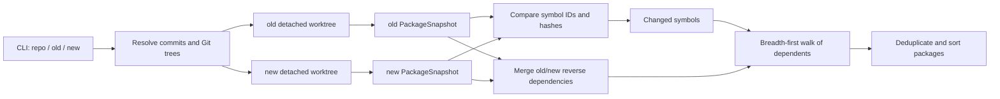

# Architecture

[简体中文](architecture.md) · [English](architecture.en.md)

This document describes how package impact analysis maps to the current ripples source code. See [Analysis](analysis.en.md) for user-facing coverage and boundaries, and [Installation and Usage](usage.en.md) for the CLI, output, and cache locations.

## End-to-End Flow



The entry point is [`main.go`](../main.go). The main algorithm is `AnalyzeDetailed` in [`internal/impact/analyzer.go`](../internal/impact/analyzer.go).

## 1. Revisions and Isolated Snapshots

In [`internal/snapshot/source.go`](../internal/snapshot/source.go), `Resolve` uses `git rev-parse --verify` to resolve the commit and tree and records the module directory relative to the Git root. `OpenRevision` creates a temporary detached worktree while preserving the repository layout, so same-repository local `replace` targets remain valid. `Source.Close` removes the worktree and returns cleanup failures to the caller.

Old and new revisions can be resolved and loaded concurrently. Git worktree metadata operations are serialized by a mutex keyed by Git root, preventing concurrent `worktree add/remove` calls in the same repository from interfering with each other. If old and new resolve to the same Git tree, ripples builds only one package snapshot.

## 2. PackageSnapshot

The core data structures are defined in [`internal/impact/snapshot.go`](../internal/impact/snapshot.go):

| Type | Purpose |
| --- | --- |
| `PackageSnapshot` | Module, package, and declaration graph for one Git tree |
| `Package` | Package path, name, content hash, and imports |
| `Symbol` | Stable declaration ID, semantic hash, package path, and dependency IDs |

`buildPackageSnapshot` loads `./...` through `golang.org/x/tools/go/packages`, requesting local ASTs, type information, imports, module metadata, embed files, and other compiler inputs without `NeedDeps`. Standard-library and third-party packages therefore remain type/import contracts whose function bodies are not traversed. The current Go toolchain, `GOOS`, `GOARCH`, build tags, and CGo configuration select the compiled files; `_test.go` files are not loaded by default.

The parser retains comments for compiler directives and `go:embed`, while skipping legacy parser object resolution. After type checking, maps in `types.Info` that are no longer needed are cleared to reduce memory retained during snapshot construction.

## 3. Symbol IDs, Hashes, and Dependencies

The declaration graph is implemented primarily in [`internal/impact/symbol.go`](../internal/impact/symbol.go). Each local declaration receives a stable ID, for example:

```text
example.com/app/payment::func::Charge
example.com/app/payment::method::Service.Pay
example.com/app/payment::field::Config.Client
example.com/app/payment::init::payment/init.go::0
```

Regular identities contain the package path, declaration kind, and name. Methods include the receiver; `init` functions use the file path and index within that file. Synthetic dispatch symbols created by interface and value-flow analysis also contain the package path and a hash of the dependency set so unrelated old/new call chains cannot be joined accidentally.

### Semantic Hashes

- Regular declarations are hashed through `ast.Fprint`, filtering source positions, ordinary comments, and parser-internal object links; constants use their complete type and exact value.
- Struct fields and interface methods are separate symbols, so a member change does not automatically contaminate every user of the enclosing type.
- [`internal/impact/buildmeta.go`](../internal/impact/buildmeta.go) adds CGo preambles and build-affecting `//go:` directives to the hash.
- [`internal/impact/embed.go`](../internal/impact/embed.go) creates content-hash symbols for `go:embed` files and connects them to their variables.
- Package hashes include compiled files, embed/other files, and imports. Reordering declarations or moving them across files may include the changed package itself, but does not create nonexistent cross-package declaration edges.

### Declaration Dependencies

Base dependencies come from `types.Info.Uses`: objects referenced by a declaration AST are converted to local symbol IDs. Three groups of Go semantics are then added:

1. Package initialization: effectful global initializers, `init` functions, and local import initialization order.
2. Embed/build inputs: embedded files, CGo preambles, and compiler directives.
3. Interfaces and function values: synthetic dispatch symbols produced by call sites, parameters, returns, fields, containers, and function-value propagation.

Dependencies are stored as sorted ID sets so snapshots and output remain stable.

## 4. Interface and Function-Value Precision

Interface and value-flow behavior is centered on `valueFlowResolver` and `interfaceCallTracer` in [`internal/impact/symbol.go`](../internal/impact/symbol.go). The resolver follows assignments, parameters, returns, fields, and containers to identify candidate concrete types or functions; the tracer connects interface calls to those candidate implementations. See [Analysis](analysis.en.md) for the complete syntax coverage.

Resolution is bounded by call sites and value flow, so two types implementing the same interface do not merge their callers. When one static location has multiple candidates, all are conservatively included. Resolution sets and candidate keys terminate recursive functions, cyclic containers, and mutually recursive calls; third-party calls use only the visible interface contract.

## 5. Module and Build-Configuration Changes

The package snapshot first hashes `go.mod`, `go.sum`, `go.work`, and `go.work.sum` as a group. Only when this hash differs between old and new does [`internal/impact/module.go`](../internal/impact/module.go) build additional module snapshots.

The module snapshot uses `NeedDeps` only to map local packages to third-party module identities and checksum keys; it does not parse third-party function bodies. It compares effective Go/toolchain configuration, the module/version/`replace` values used by each local package, and checksums for module/version keys present in both revisions.

Changed local packages are injected into the declaration graph through their package-init symbols and then use the same reverse-propagation algorithm. Adding or removing ordinary `go.sum` cache entries does not broaden the impact set.

## 6. Old/New Comparison and Reverse Propagation

The main algorithm is in [`internal/impact/analyzer.go`](../internal/impact/analyzer.go):

1. `changedSymbols` compares old/new symbol IDs and hashes to find additions, removals, and modifications; synthetic dispatch symbols are not direct change roots.
2. `reverseDependencies` merges old/new local declaration edges and reverses them from dependency to dependent.
3. `transitiveDependents` performs one breadth-first traversal from all changed roots; the `affected` set deduplicates results and converging paths.
4. Symbols are collapsed into packages and sorted by relative path, package name, and full path.

Merging both graphs is what makes additions and removals correct: removals use call edges that still exist in the old graph, while additions use edges from the new graph. Reading only the current working tree or only one snapshot would lose relationships from the other side.

`AnalyzeDetailed` also collapses declaration edges into cross-package edges used by DOT output.

## 7. Cache

[`internal/snapshot/cache.go`](../internal/snapshot/cache.go) implements a content-addressed JSON cache with two namespaces:

```text
package-snapshots/<key>.json
module-snapshots/<key>.json
```

Analysis keys contain the analysis format version, graph kind, Git tree, repository-relative module directory, Go runtime version, and `GOOS`, `GOARCH`, `CGO_ENABLED`, `GOFLAGS`, and `GOEXPERIMENT`.

A cache hit avoids creating a worktree. A corrupt or unreadable entry falls back to rebuilding; a write failure is returned so the caller does not mistake an unpersisted result for a successful cache write. Entries are written to temporary files and atomically committed with rename.

Changes to the snapshot schema or analysis semantics must increment `analysisVersion`; changes to the generic cache encoding must increment `cacheVersion`.

## 8. Concurrency and Memory Boundaries

[`internal/impact/concurrency.go`](../internal/impact/concurrency.go) implements `parallelFor` with at most `GOMAXPROCS` workers and stores errors by input index. It handles old/new revision and module snapshot loading, package summaries, declaration hashes, and base dependencies.

Old and new package snapshots are also loaded concurrently. Each package and declaration is summarized once per snapshot. The propagation phase uses one shared `affected` set, so multiple changes converging on one declaration do not traverse that declaration repeatedly.

Memory is bounded by omitting third-party `NeedDeps` from the primary package graph, clearing unused `types.Info` maps after type checking, and persisting snapshots without full ASTs. A cold analysis still holds the current module's AST and required type information.

## 9. Code and Test Map

| Concern | Implementation | Main tests |
| --- | --- | --- |
| Revision/worktree | [`internal/snapshot/source.go`](../internal/snapshot/source.go) | [`internal/snapshot/source_test.go`](../internal/snapshot/source_test.go) |
| Persistent cache | [`internal/snapshot/cache.go`](../internal/snapshot/cache.go) | [`internal/snapshot/cache_test.go`](../internal/snapshot/cache_test.go) |
| Package snapshot/hash | [`internal/impact/snapshot.go`](../internal/impact/snapshot.go) | [`internal/impact/snapshot_test.go`](../internal/impact/snapshot_test.go) |
| Symbols, interfaces, and value flow | [`internal/impact/symbol.go`](../internal/impact/symbol.go) | [`internal/impact/analyzer_test.go`](../internal/impact/analyzer_test.go), [`internal/impact/interface_flow_test.go`](../internal/impact/interface_flow_test.go) |
| Modules/workspaces | [`internal/impact/module.go`](../internal/impact/module.go) | [`internal/impact/module_test.go`](../internal/impact/module_test.go) |
| CGo/compiler directives | [`internal/impact/buildmeta.go`](../internal/impact/buildmeta.go) | [`internal/impact/buildmeta_test.go`](../internal/impact/buildmeta_test.go) |
| `go:embed` | [`internal/impact/embed.go`](../internal/impact/embed.go) | [`internal/impact/analyzer_test.go`](../internal/impact/analyzer_test.go) |
| Reverse propagation/package graph | [`internal/impact/analyzer.go`](../internal/impact/analyzer.go) | [`internal/impact/analyzer_test.go`](../internal/impact/analyzer_test.go) |
| Concurrent workers | [`internal/impact/concurrency.go`](../internal/impact/concurrency.go) | [`internal/impact/concurrency_test.go`](../internal/impact/concurrency_test.go) |
| Output | [`internal/output/reporter.go`](../internal/output/reporter.go) | [`internal/output/reporter_test.go`](../internal/output/reporter_test.go) |
