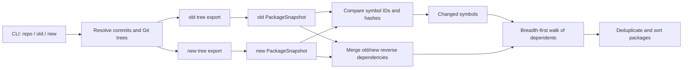

# Architecture

[简体中文](architecture.md) · [English](architecture.en.md)

This document describes how package impact analysis maps to the current ripples source code. See [Analysis](analysis.en.md) for user-facing coverage and boundaries, and [Installation and Usage](usage.en.md) for the CLI, output, and cache locations.

## End-to-End Flow


```mermaid
flowchart LR
    CLI["CLI: repo / old / new"] --> Resolve["Resolve commits and Git trees"]
    Resolve --> Old["old tree export"]
    Resolve --> New["new tree export"]
    Old --> OldSnapshot["old PackageSnapshot"]
    New --> NewSnapshot["new PackageSnapshot"]
    OldSnapshot --> Compare["Compare symbol IDs and hashes"]
    NewSnapshot --> Compare
    Compare --> Changed["Changed symbols"]
    OldSnapshot --> Reverse["Merge old/new reverse dependencies"]
    NewSnapshot --> Reverse
    Changed --> Walk["Breadth-first walk of dependents"]
    Reverse --> Walk
    Walk --> Packages["Deduplicate and sort packages"]
```

The entry point is [`main.go`](../main.go). The main algorithm is `AnalyzeDetailed` in [`internal/impact/analyzer.go`](../internal/impact/analyzer.go). The CLI uses `signal.NotifyContext`, so Ctrl-C or CI cancellation stops git and go subprocesses through the context and removes temporary directories.

## 1. Revisions and Isolated Exports

In [`internal/snapshot/source.go`](../internal/snapshot/source.go), `Resolve` uses `git rev-parse --verify` to resolve the commit and tree and records the module directory relative to the Git root. `OpenRevision` runs `git read-tree` against a private index named by `GIT_INDEX_FILE` and then `git checkout-index --stdin --prefix` to export the complete tree into a temporary directory. Writing thousands of files is bound by file-system calls, so every directory is created first and the files are split by directory across up to 8 `checkout-index` processes writing in parallel; files whose directories differ only in case share a process, so case-insensitive file systems still resolve such collisions in index order:

- No worktree is registered and the repository's own index is untouched, so an interrupted run leaves nothing in `.git`.
- `checkout-index` runs no hooks.
- `-c core.sparseCheckout=false` exports the whole tree even when the user's repository uses sparse checkout.
- `GIT_LFS_SKIP_SMUDGE=1` keeps LFS files as pointers; analysis never needs their content.

The export preserves the repository layout, so same-repository local `replace` targets and a `go.work` in a parent directory remain valid. Every export uses its own index, so old and new can be exported concurrently. `Source.Close` removes the top-level directories concurrently and then the temporary directory; the analysis runs the removal in the background while it stores the snapshot and analyzes the other revision, and waits for it, reporting errors, before returning. If old and new resolve to the same Git tree, ripples builds only one package snapshot.

## 2. PackageSnapshot

The core data structures are defined in [`internal/impact/snapshot.go`](../internal/impact/snapshot.go):

| Type | Purpose |
| --- | --- |
| `PackageSnapshot` | Module information, packages, and declaration graph for one Git tree |
| `Package` | Package path, name, and content hash; analysis results also mark deleted packages |
| `Symbol` | Stable declaration ID, semantic hash, package path, and dependency IDs |

`buildPackageSnapshot` first runs the optional `-prepare` command, then `loadPackages` in [`internal/impact/load.go`](../internal/impact/load.go) loads `./...`:

1. `golang.org/x/tools/go/packages` reads metadata: files, the import graph, modules, embed files, test variants, and type sizes. No types are requested, so `go list` runs without `-export` and compiles nothing.
2. The packages matching `./...` and the test variants they use are type-checked from source; every other package is a dependency, and a second go/packages load reads export data for those only. `go list -export` compiles just these dependencies, once per version, after which the Go build cache reuses them; dependencies loaded together share type objects. Standard-library and third-party packages therefore remain type contracts whose function bodies are not traversed.
3. Local packages are type-checked concurrently with `go/types` in import order, and a file shared by test variants is parsed once. Variants recompiled only for tests, which are not analyzed, skip function bodies.

Reading the metadata and preparing the dependencies' export data each take `go list` about a second, so both run at once. Loading starts by parsing the module's Go files concurrently (skipping `vendor`, `testdata`, directories starting with `.` or `_`, nested modules, and test files without `-tests`), takes their imports outside the module as a guess of the dependencies, and immediately loads that export data. Once the metadata arrives, the actual dependencies are checked against the guess; if the guess missed any or a guessed package has errors, it is discarded and the actual dependencies are loaded again, so all dependency types come from one load. The files parsed up front go into the same parse cache that type checking reuses.

When go/packages type-checks by itself, `go list -export` also compiles the local packages, which are then checked from source anyway. In a repository with about 3,000 Go files that compilation took most of the cold analysis time and kept growing the Go build cache, so go/packages now only provides metadata and dependency export data. Both `go list` runs pass `-trimpath`, which makes cgo output and compiled dependencies independent of the export directory so they are reused across runs and trees; `-trimpath` only changes the paths recorded in the `//line` directives of cgo-generated files (to module-path form), which are equally stable across exports. The current Go toolchain, `GOOS`, `GOARCH`, build tags, and CGo configuration select the compiled files.

Test variants are loaded only with `-tests`. The default result drives builds and deployments, which do not need test files; tests are often larger than the non-test code, and loading them makes cold analyses noticeably slower. `-tests` is part of the cache key, so the two modes never share snapshots.

Loading tests returns several variants of a package: the plain package `p`, `p [p.test]` including its `_test.go` files, the external test package `p_test [p.test]`, and dependencies recompiled for the test such as `q [p.test]`. The generated test main is dropped; the first three are analyzed, while `q [p.test]` is only type-checked so imports resolve:

- `reportPath` reports in-package test variants and external test packages as the package under test, while recompiled dependencies keep their own path.
- A declaration gets the same ID in every variant, so the variants collapse into one symbol, while the type objects of every variant are registered and references from external tests resolve.
- The variants of one package merge into one `Package` whose hash covers all of them and whose name comes from the plain package.

The parser retains comments for compiler directives and `go:embed`, while skipping legacy parser object resolution.

## 3. Symbol IDs, Hashes, and Dependencies

The declaration graph is implemented primarily in [`internal/impact/symbol.go`](../internal/impact/symbol.go). Each local declaration receives a stable ID, for example:

```text
example.com/app/payment::func::Charge
example.com/app/payment::method::Service.Pay
example.com/app/payment::field::Config.Client
example.com/app/payment::init::payment/init.go::0
```

Regular identities contain the package path, declaration kind, and name. Methods include the receiver; `init` functions and blank initializers use the file path and their index within that file, so a declaration has the same ID in a package and its test variant. cgo-processed files use the original file name from their line directives.

### Semantic Hashes

- Regular declarations are hashed by [`internal/impact/asthash.go`](../internal/impact/asthash.go), which walks the syntax tree through reflection and writes the type of every node and the values of its other fields, filtering source positions, ordinary comments, and parser-internal object links. It covers the same fields as `ast.Fprint` but writes compact binary data instead of formatted text, which is an order of magnitude faster. Only two position fields carry meaning and are recorded as present or absent: the `...` of a call (`f(xs...)` versus `f(xs)`) and the `=` of a type alias (`type A = B` versus `type A B`). Constants use their complete type and exact value.
- Struct fields and interface methods are separate symbols, so a member change does not automatically contaminate every user of the enclosing type.
- [`internal/impact/buildmeta.go`](../internal/impact/buildmeta.go) adds CGo preambles and build-affecting `//go:` directives to the hash.
- [`internal/impact/embed.go`](../internal/impact/embed.go) creates content-hash symbols for `go:embed` files and connects them to their variables.
- Each package with non-Go sources (assembly, C/C++, headers, syso) has an input symbol hashing their paths and contents.
- Package hashes include compiled files, embed/other files, and imports. Reordering declarations or moving them across files may include the changed package itself, but does not create nonexistent cross-package declaration edges.

### Declaration Dependencies

Base dependencies come from `types.Info` and are collected by `addReferenceDependencies` in one AST walk:

- Local objects referenced through `Uses`. Methods and fields of instantiated generics map back to the generic declaration through `Origin()`.
- Embedded fields on the index path of a `Selections` entry, so replacing an embedded type reaches users of the promoted fields and methods.
- Unkeyed struct literals depend on the layout symbol of their type.
- Contracts of the type arguments when calling a generic function (an `Instances` entry whose object is a function) or selecting a method of an instantiated generic type. Merely naming an instantiated type runs no generic code and adds no such dependency.

Additional Go semantics are then added:

1. Package initialization: one package-init symbol per package variant, identified by package ID. It depends on the `init` functions and runtime-effectful named and blank variable initializers in that variant's own files and on the package-init of its local imports, so `init` functions in test files never reach importers of the plain package. `types.Info` distinguishes function calls from conversions; conversion operands are still traversed, and slice conversions to non-empty arrays or array pointers retain initialization dependencies because they may panic at run time. This is a syntax-level effect model and does not infer every panic condition that depends on runtime values.
2. Embed/build inputs: embedded files, CGo preambles, and compiler directives; declarations without a Go body and declarations from cgo-processed files depend on the package's non-Go input symbol.
3. Type contracts and interface conversions, described next.

Dependencies are stored as sorted ID sets so snapshots and output remain stable.

## 4. Type Contracts and Interface Conversions

The implementation lives in [`internal/impact/contract.go`](../internal/impact/contract.go). [ADR-0001](adr/0001-interface-conversion-contracts.md) (Chinese) records why this approach was chosen over hand-written value flow or VTA.

Every package-level named non-interface type has three synthetic symbols:

- layout: hashed from `types.TypeString` of the underlying type, covering field order, types, and tags.
- contract: depends on the layout, every method in the method set of `*T` (including promoted methods), and the contracts of local named types used in its fields and elements.
- dispatch: depends on the layout, the methods in the method set of `*T` that can be invoked dynamically anywhere, and the dispatch symbols of local named types used in its fields and elements. Methods that only local code calls through interfaces are recorded in `Symbol.Dynamic` as conditional dependencies together with the calling declarations.

`collectDynamicMethods` walks the syntax of every local declaration and collects, by method ID, the interfaces that can invoke a method dynamically: interface-receiver methods in `TypesInfo.Uses` (only the method called, with the declaration making the call as its caller) and every method of interfaces in type assertions and type switches; it also collects every method of interface types in the scopes of transitive dependencies, and `error`. Method m of `*T` matches a recorded interface J exactly when J contains m with a `types.Identical` signature and `types.Implements(*T, J)` holds. Methods of generic types and interfaces that mention type parameters match by name, because implementation cannot be decided before instantiation. If any matching record has no caller (type assertions, dependency interfaces), or m is named `Unwrap`, `Is`, `As`, `Timeout`, or `Temporary` (which the standard library checks through anonymous interfaces), m is a plain dependency of dispatch; otherwise all calling declarations are recorded as a conditional dependency. [ADR-0002](adr/0002-dispatch-contracts.md) (Chinese) records the trade-offs.

`addConversionDependencies` builds SSA for the local packages with the official `golang.org/x/tools/go/ssa` package; only the direct imports of local packages get type-only packages from export data (SSA creates methods of indirect dependencies on demand), and no dependency function bodies are built. Local packages are built concurrently, one package per worker, and each package's function bodies are scanned and dropped right after it is built, so only the SSA bodies of packages in flight are in memory at once. SSA makes every implicit conversion explicit as `MakeInterface`:

- Conversions in functions and methods, including closures, belong to the enclosing declaration.
- Package variable initializers are compiled into the synthetic package initializer. A conversion belongs to the global it is stored into; otherwise it is placed by the position of the instruction consuming the value within an initializer's source range; if neither works it falls back to package-init, which is conservative.

The converting declaration depends on a contract of the converted type and of the local named types inside its composite types and type arguments: contract when the target is the empty interface or implements `error`, dispatch otherwise. No value-flow tracking is needed: wherever the interface value flows afterwards (setters, functional options, registries, embedded fields, external parameters such as `fmt` and `encoding/json`), the impact propagates from the conversion site, and analysis time grows linearly with the code. Conditional dependencies are resolved per package during reverse propagation, described in the next section.

## 5. Module and Build-Configuration Changes

Module information comes from the same metadata load as the package snapshot, so the package graph and the module graph always describe one Git tree. [`internal/impact/module.go`](../internal/impact/module.go) follows its dependency graph to map local packages (excluding test variants) to third-party module identities and checksum keys; it does not parse third-party function bodies.

- `go env GOWORK`, run in the exported module directory, locates the effective go.work, which may live in a parent directory or come from `GOWORK`.
- The effective configuration hash uses go/toolchain/godebug from the module's go.mod and that go.work.
- Checksums come from the module's go.sum plus, in workspace mode, go.work.sum and the go.sum of every used module.

The comparison covers effective Go/toolchain configuration, the module/version/`replace` values used by each local package, and checksums for module/version keys present in both revisions. Changed local packages are injected into the declaration graph through their package-init symbols and then use the same reverse-propagation algorithm. Adding or removing ordinary `go.sum` cache entries does not broaden the impact set.

## 6. Old/New Comparison and Reverse Propagation

The main algorithm is in [`internal/impact/analyzer.go`](../internal/impact/analyzer.go):

1. `changedSymbols` compares old/new symbol IDs and hashes to find additions, removals, and modifications.
2. `reverseDependencies` merges old/new local declaration edges and reverses them from dependency to dependent.
3. `transitiveDependents` propagates along plain edges from all changed roots; the `affected` set deduplicates results and converging paths. When an affected declaration is the method of a conditional dependency, it computes two reverse closures, counting conditional dependencies as plain edges as a conservative approximation: declarations reaching that dispatch symbol (the conversion side), and the calling declarations together with the declarations reaching them (the call side). Only in packages present on both sides are the declarations of either side marked; they do not propagate further along plain edges, because their users only run the method if their own packages meet both sides too. The sides meet per package rather than per declaration because package initialization and `main` are declarations of one binary that do not reference each other. Closures are cached by starting point.
4. Symbols are collapsed into packages and sorted by relative path, package name, and full path; packages that exist only in the old revision are marked `Deleted`.

Merging both graphs is what makes additions and removals correct: removals use call edges that still exist in the old graph, while additions use edges from the new graph. Reading only the current working tree or only one snapshot would lose relationships from the other side.

`AnalyzeDetailed` also collapses declaration edges into cross-package edges used by DOT output; declarations marked through a conditional dependency hang off the method that triggered them, which keeps the graph connected.

## 7. Cache

[`internal/snapshot/cache.go`](../internal/snapshot/cache.go) implements a content-addressed, gzip-compressed JSON cache. Each tree's snapshot is split into a manifest and chunks: `snapshots/<key>.json.gz` only records the tree, module path, and chunk keys; `snapshot-chunks/<content hash>.json.gz` holds one chunk per package (package metadata, its module dependencies, and all of its symbols) plus one chunk for module checksums. Chunks are keyed by content hash, so unchanged packages share one chunk across trees and caching another commit only adds the chunks of the packages it changed. A missing chunk turns the entry into a miss, which rebuilds the snapshot.

Analysis keys contain the analysis format version, graph kind, Git tree, repository-relative module directory, the Go version ripples was built with, the effective build configuration reported by `go env -json` (run outside any module, so it includes environment variables and `go env -w` settings), the `-prepare` command, and `-tests`.

A cache hit avoids exporting the tree and refreshes the entry's modification time. After every analysis, `Prune` first removes entries that were not read or written for 7 days; while the total size still exceeds `MaxBytes` (1024 MB by default, overridden by `RIPPLES_CACHE_MAX_MB`), it removes entries from the oldest modification time on. Pruning only covers the namespaces listed by `impact.CacheNamespaces` (including `package-snapshots` and `module-snapshots` from earlier versions) and only removes entry files (`*.json.gz`, or `*.json` from earlier versions) and temporary files left by interrupted writes; temporary files only age out and never count toward the size limit, so a file another process is still writing is not removed. The cache directory can therefore be shared with other files. A corrupt or unreadable entry falls back to rebuilding; a write failure is returned so the caller does not mistake an unpersisted result for a successful cache write. Entries are written to temporary files and atomically committed with rename.

Changes to the snapshot schema or analysis semantics must increment `analysisVersion`; changes to the generic cache encoding must increment `cacheVersion`.

## 8. Concurrency and Memory Boundaries

[`internal/impact/concurrency.go`](../internal/impact/concurrency.go) implements `parallelFor` with at most `GOMAXPROCS` workers and stores errors by input index. It resolves old/new revisions and handles parsing the module ahead of the metadata, package summaries, declaration hashes and base dependencies, dynamic-method collection, type contracts, building and scanning SSA one package at a time, and writing and reading snapshot chunks.

While one snapshot is built, these steps overlap:

| Running concurrently | Synchronization |
| --- | --- |
| The metadata `go list` and "parse files ahead + load the guessed dependencies' export data" | After the metadata arrives, the guess is awaited and checked |
| The module snapshot and package summaries plus declaration summaries | It only reads settled metadata; awaited before the result is assembled |
| SSA conversion scanning and declaration hashes, initialization dependencies, dynamic methods, type contracts | Starts once `objectIDs` is settled; awaited before merging into `symbols` |
| Removing the export and storing the snapshot or analyzing the other revision | Awaited before the analysis returns |

Concurrent code follows one set of rules: the shared ASTs, `types.Info`, metadata graph, and `objectIDs` are settled before a concurrent step starts and only read afterwards; workers only write the result slot of their own index, and merging happens serially after all workers finish; shared writes (the parse cache, background removal errors) are guarded by a mutex; and waits sit in `defer`, so early returns leave no goroutine or `go list` process running. The whole test suite passes under `-race`.

Old and new package snapshots are built one after the other: building one snapshot already uses every CPU, and building both at once only doubles peak memory, while cache hits are fast enough that the order costs nothing. Each declaration is summarized once per snapshot. The propagation phase uses one shared `affected` set, so multiple changes converging on one declaration do not traverse that declaration repeatedly.

Dependencies only load metadata and export data, never source, and persisted snapshots contain neither ASTs nor SSA. The peak memory of a cold analysis comes from holding the current module's ASTs, `types.Info`, and dependency type information at once, including test variants with `-tests`; SSA functions keep referencing their syntax and their package's `types.Info`, so this data cannot be released before scanning ends. A cold analysis of a module with about 3,000 Go files keeps about 400–500 MB live.

## 9. Code and Test Map

| Concern | Implementation | Main tests |
| --- | --- | --- |
| Revision/export | [`internal/snapshot/source.go`](../internal/snapshot/source.go) | [`internal/snapshot/source_test.go`](../internal/snapshot/source_test.go) |
| Persistent cache | [`internal/snapshot/cache.go`](../internal/snapshot/cache.go) | [`internal/snapshot/cache_test.go`](../internal/snapshot/cache_test.go) |
| Loading and type checking | [`internal/impact/load.go`](../internal/impact/load.go) | [`internal/impact/analyzer_test.go`](../internal/impact/analyzer_test.go) |
| Package snapshot/hash/test variants | [`internal/impact/snapshot.go`](../internal/impact/snapshot.go) | [`internal/impact/snapshot_test.go`](../internal/impact/snapshot_test.go), [`internal/impact/analyzer_test.go`](../internal/impact/analyzer_test.go) |
| Declarations and dependencies | [`internal/impact/symbol.go`](../internal/impact/symbol.go) | [`internal/impact/analyzer_test.go`](../internal/impact/analyzer_test.go) |
| Syntax hashes | [`internal/impact/asthash.go`](../internal/impact/asthash.go) | [`internal/impact/snapshot_test.go`](../internal/impact/snapshot_test.go) |
| Type contracts and interface conversions | [`internal/impact/contract.go`](../internal/impact/contract.go) | [`internal/impact/interface_flow_test.go`](../internal/impact/interface_flow_test.go) |
| Modules/workspaces | [`internal/impact/module.go`](../internal/impact/module.go) | [`internal/impact/module_test.go`](../internal/impact/module_test.go) |
| CGo/compiler directives | [`internal/impact/buildmeta.go`](../internal/impact/buildmeta.go) | [`internal/impact/buildmeta_test.go`](../internal/impact/buildmeta_test.go) |
| `go:embed` | [`internal/impact/embed.go`](../internal/impact/embed.go) | [`internal/impact/analyzer_test.go`](../internal/impact/analyzer_test.go) |
| Reverse propagation/package graph | [`internal/impact/analyzer.go`](../internal/impact/analyzer.go) | [`internal/impact/analyzer_test.go`](../internal/impact/analyzer_test.go) |
| Concurrent workers | [`internal/impact/concurrency.go`](../internal/impact/concurrency.go) | [`internal/impact/concurrency_test.go`](../internal/impact/concurrency_test.go) |
| Output | [`internal/output/reporter.go`](../internal/output/reporter.go) | [`internal/output/reporter_test.go`](../internal/output/reporter_test.go) |
