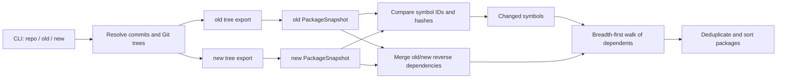

# Architecture

[简体中文](architecture.md) · [English](architecture.en.md)

This document describes how package impact analysis maps to the current ripples source code. See [Analysis](analysis.en.md) for user-facing coverage and boundaries, and [Installation and Usage](usage.en.md) for the CLI, output, and cache locations.

## End-to-End Flow


```mermaid
flowchart LR
    CLI["CLI: repo / old / new"] --> Resolve["Resolve commits and Git trees"]
    Resolve --> Old["old tree export"]
    Resolve --> New["new tree export"]
    Old --> OldSnapshot["old PackageSnapshot"]
    New --> NewSnapshot["new PackageSnapshot"]
    OldSnapshot --> Compare["Compare symbol IDs and hashes"]
    NewSnapshot --> Compare
    Compare --> Changed["Changed symbols"]
    OldSnapshot --> Reverse["Merge old/new reverse dependencies"]
    NewSnapshot --> Reverse
    Changed --> Walk["Breadth-first walk of dependents"]
    Reverse --> Walk
    Walk --> Packages["Deduplicate and sort packages"]
```

The entry point is [`main.go`](../main.go). The main algorithm is `AnalyzeDetailed` in [`internal/impact/analyzer.go`](../internal/impact/analyzer.go). The CLI uses `signal.NotifyContext`, so Ctrl-C or CI cancellation stops git and go subprocesses through the context and removes temporary directories.

## 1. Revisions and Isolated Exports

In [`internal/snapshot/source.go`](../internal/snapshot/source.go), `Resolve` uses `git rev-parse --verify` to resolve the commit and tree and records the module directory relative to the Git root. `OpenRevision` runs `git read-tree` and `git checkout-index --all --prefix` against a private index named by `GIT_INDEX_FILE`, exporting the complete tree into a temporary directory:

- No worktree is registered and the repository's own index is untouched, so an interrupted run leaves nothing in `.git`.
- `checkout-index` runs no hooks.
- `-c core.sparseCheckout=false` exports the whole tree even when the user's repository uses sparse checkout.
- `GIT_LFS_SKIP_SMUDGE=1` keeps LFS files as pointers; analysis never needs their content.

The export preserves the repository layout, so same-repository local `replace` targets and a `go.work` in a parent directory remain valid. Every export uses its own index, so old and new can be exported concurrently. `Source.Close` removes the temporary directory. If old and new resolve to the same Git tree, ripples builds only one package snapshot.

## 2. PackageSnapshot

The core data structures are defined in [`internal/impact/snapshot.go`](../internal/impact/snapshot.go):

| Type | Purpose |
| --- | --- |
| `PackageSnapshot` | Module information, packages, and declaration graph for one Git tree |
| `Package` | Package path, name, and content hash; analysis results also mark deleted packages |
| `Symbol` | Stable declaration ID, semantic hash, package path, and dependency IDs |

`buildPackageSnapshot` first runs the optional `-prepare` command, then loads `./...` with `Tests: true` through `golang.org/x/tools/go/packages`, requesting local ASTs, type information, imports, module metadata, embed files, and other compiler inputs without `NeedDeps`. Standard-library and third-party packages therefore remain type/import contracts whose function bodies are not traversed. The current Go toolchain, `GOOS`, `GOARCH`, build tags, and CGo configuration select the compiled files.

Loading tests returns several variants of a package: the plain package `p`, `p [p.test]` including its `_test.go` files, the external test package `p_test [p.test]`, and dependencies recompiled for the test such as `q [p.test]`. The generated test main is dropped; every other variant is analyzed:

- `reportPath` reports in-package test variants and external test packages as the package under test, while recompiled dependencies keep their own path.
- A declaration gets the same ID in every variant, so the variants collapse into one symbol, while the type objects of every variant are registered and references from external tests resolve.
- The variants of one package merge into one `Package` whose hash covers all of them and whose name comes from the plain package.

The parser retains comments for compiler directives and `go:embed`, while skipping legacy parser object resolution.

## 3. Symbol IDs, Hashes, and Dependencies

The declaration graph is implemented primarily in [`internal/impact/symbol.go`](../internal/impact/symbol.go). Each local declaration receives a stable ID, for example:

```text
example.com/app/payment::func::Charge
example.com/app/payment::method::Service.Pay
example.com/app/payment::field::Config.Client
example.com/app/payment::init::payment/init.go::0
```

Regular identities contain the package path, declaration kind, and name. Methods include the receiver; `init` functions and blank initializers use the file path and their index within that file, so a declaration has the same ID in a package and its test variant. cgo-processed files use the original file name from their line directives.

### Semantic Hashes

- Regular declarations are hashed through `ast.Fprint`, filtering source positions, ordinary comments, and parser-internal object links; constants use their complete type and exact value.
- Struct fields and interface methods are separate symbols, so a member change does not automatically contaminate every user of the enclosing type.
- [`internal/impact/buildmeta.go`](../internal/impact/buildmeta.go) adds CGo preambles and build-affecting `//go:` directives to the hash.
- [`internal/impact/embed.go`](../internal/impact/embed.go) creates content-hash symbols for `go:embed` files and connects them to their variables.
- Each package with non-Go sources (assembly, C/C++, headers, syso) has an input symbol hashing their paths and contents.
- Package hashes include compiled files, embed/other files, and imports. Reordering declarations or moving them across files may include the changed package itself, but does not create nonexistent cross-package declaration edges.

### Declaration Dependencies

Base dependencies come from `types.Info` and are collected by `addReferenceDependencies` in one AST walk:

- Local objects referenced through `Uses`. Methods and fields of instantiated generics map back to the generic declaration through `Origin()`.
- Embedded fields on the index path of a `Selections` entry, so replacing an embedded type reaches users of the promoted fields and methods.
- Unkeyed struct literals depend on the layout symbol of their type.
- Contracts of the type arguments recorded in `Instances`.

Additional Go semantics are then added:

1. Package initialization: one package-init symbol per package variant, identified by package ID. It depends on the `init` functions and runtime-effectful named and blank variable initializers in that variant's own files and on the package-init of its local imports, so `init` functions in test files never reach importers of the plain package. `types.Info` distinguishes function calls from conversions; conversion operands are still traversed, and slice conversions to non-empty arrays or array pointers retain initialization dependencies because they may panic at run time. This is a syntax-level effect model and does not infer every panic condition that depends on runtime values.
2. Embed/build inputs: embedded files, CGo preambles, and compiler directives; declarations without a Go body and declarations from cgo-processed files depend on the package's non-Go input symbol.
3. Type contracts and interface conversions, described next.

Dependencies are stored as sorted ID sets so snapshots and output remain stable.

## 4. Type Contracts and Interface Conversions

The implementation lives in [`internal/impact/contract.go`](../internal/impact/contract.go). [ADR-0001](adr/0001-interface-conversion-contracts.md) (Chinese) records why this approach was chosen over hand-written value flow or VTA.

Every package-level named non-interface type has two synthetic symbols:

- layout: hashed from `types.TypeString` of the underlying type, covering field order, types, and tags.
- contract: depends on the layout, every method in the method set of `*T` (including promoted methods), and the contracts of local named types used in its fields and elements.

`addConversionDependencies` builds SSA for the local packages with the official `golang.org/x/tools/go/ssa` package; dependencies get type-only packages from export data and no function bodies. SSA makes every implicit conversion explicit as `MakeInterface`:

- Conversions in functions and methods, including closures, belong to the enclosing declaration.
- Package variable initializers are compiled into the synthetic package initializer. A conversion belongs to the global it is stored into; otherwise it is placed by the position of the instruction consuming the value within an initializer's source range; if neither works it falls back to package-init, which is conservative.

The converting declaration depends on the contract of the converted type and of the local named types inside its composite types and type arguments. No value-flow tracking is needed: wherever the interface value flows afterwards (setters, functional options, registries, embedded fields, external `any` parameters such as `fmt` and `encoding/json`), the impact lands on the declaration that performed the conversion, and analysis time grows linearly with the code. The cost is that a conversion site depends on every method of the type, not only those the interface declares.

## 5. Module and Build-Configuration Changes

Module information is computed from the same export as the package snapshot, so the package graph and the module graph always describe one Git tree. [`internal/impact/module.go`](../internal/impact/module.go) loads metadata with `NeedDeps` only to map local packages to third-party module identities and checksum keys; it does not parse third-party function bodies.

- `go env GOWORK`, run in the exported module directory, locates the effective go.work, which may live in a parent directory or come from `GOWORK`.
- The effective configuration hash uses go/toolchain/godebug from the module's go.mod and that go.work.
- Checksums come from the module's go.sum plus, in workspace mode, go.work.sum and the go.sum of every used module.

The comparison covers effective Go/toolchain configuration, the module/version/`replace` values used by each local package, and checksums for module/version keys present in both revisions. Changed local packages are injected into the declaration graph through their package-init symbols and then use the same reverse-propagation algorithm. Adding or removing ordinary `go.sum` cache entries does not broaden the impact set.

## 6. Old/New Comparison and Reverse Propagation

The main algorithm is in [`internal/impact/analyzer.go`](../internal/impact/analyzer.go):

1. `changedSymbols` compares old/new symbol IDs and hashes to find additions, removals, and modifications.
2. `reverseDependencies` merges old/new local declaration edges and reverses them from dependency to dependent.
3. `transitiveDependents` performs one breadth-first traversal from all changed roots; the `affected` set deduplicates results and converging paths.
4. Symbols are collapsed into packages and sorted by relative path, package name, and full path; packages that exist only in the old revision are marked `Deleted`.

Merging both graphs is what makes additions and removals correct: removals use call edges that still exist in the old graph, while additions use edges from the new graph. Reading only the current working tree or only one snapshot would lose relationships from the other side.

`AnalyzeDetailed` also collapses declaration edges into cross-package edges used by DOT output.

## 7. Cache

[`internal/snapshot/cache.go`](../internal/snapshot/cache.go) implements a content-addressed, gzip-compressed JSON cache; snapshots are written to `package-snapshots/<key>.json.gz`. Snapshots repeat long declaration IDs, so compression shrinks them to about one sixth.

Analysis keys contain the analysis format version, graph kind, Git tree, repository-relative module directory, the Go version ripples was built with, the effective build configuration reported by `go env -json` (run outside any module, so it includes environment variables and `go env -w` settings), and the `-prepare` command.

A cache hit avoids exporting the tree and refreshes the entry's modification time. After every analysis, `Prune` removes entries that were not read or written for 7 days. A corrupt or unreadable entry falls back to rebuilding; a write failure is returned so the caller does not mistake an unpersisted result for a successful cache write. Entries are written to temporary files and atomically committed with rename.

Changes to the snapshot schema or analysis semantics must increment `analysisVersion`; changes to the generic cache encoding must increment `cacheVersion`.

## 8. Concurrency and Memory Boundaries

[`internal/impact/concurrency.go`](../internal/impact/concurrency.go) implements `parallelFor` with at most `GOMAXPROCS` workers and stores errors by input index. It handles old/new revisions, package summaries, declaration hashes, and base dependencies; `ssa.Program.Build` builds SSA concurrently.

Old and new package snapshots are also loaded concurrently. Each declaration is summarized once per snapshot. The propagation phase uses one shared `affected` set, so multiple changes converging on one declaration do not traverse that declaration repeatedly.

The primary package graph omits third-party `NeedDeps`, and persisted snapshots contain neither ASTs nor SSA. A cold analysis holds the current module's ASTs, type information, and SSA, including test variants.

## 9. Code and Test Map

| Concern | Implementation | Main tests |
| --- | --- | --- |
| Revision/export | [`internal/snapshot/source.go`](../internal/snapshot/source.go) | [`internal/snapshot/source_test.go`](../internal/snapshot/source_test.go) |
| Persistent cache | [`internal/snapshot/cache.go`](../internal/snapshot/cache.go) | [`internal/snapshot/cache_test.go`](../internal/snapshot/cache_test.go) |
| Package snapshot/hash/test variants | [`internal/impact/snapshot.go`](../internal/impact/snapshot.go) | [`internal/impact/snapshot_test.go`](../internal/impact/snapshot_test.go), [`internal/impact/analyzer_test.go`](../internal/impact/analyzer_test.go) |
| Declarations and dependencies | [`internal/impact/symbol.go`](../internal/impact/symbol.go) | [`internal/impact/analyzer_test.go`](../internal/impact/analyzer_test.go) |
| Type contracts and interface conversions | [`internal/impact/contract.go`](../internal/impact/contract.go) | [`internal/impact/interface_flow_test.go`](../internal/impact/interface_flow_test.go) |
| Modules/workspaces | [`internal/impact/module.go`](../internal/impact/module.go) | [`internal/impact/module_test.go`](../internal/impact/module_test.go) |
| CGo/compiler directives | [`internal/impact/buildmeta.go`](../internal/impact/buildmeta.go) | [`internal/impact/buildmeta_test.go`](../internal/impact/buildmeta_test.go) |
| `go:embed` | [`internal/impact/embed.go`](../internal/impact/embed.go) | [`internal/impact/analyzer_test.go`](../internal/impact/analyzer_test.go) |
| Reverse propagation/package graph | [`internal/impact/analyzer.go`](../internal/impact/analyzer.go) | [`internal/impact/analyzer_test.go`](../internal/impact/analyzer_test.go) |
| Concurrent workers | [`internal/impact/concurrency.go`](../internal/impact/concurrency.go) | [`internal/impact/concurrency_test.go`](../internal/impact/concurrency_test.go) |
| Output | [`internal/output/reporter.go`](../internal/output/reporter.go) | [`internal/output/reporter_test.go`](../internal/output/reporter_test.go) |
