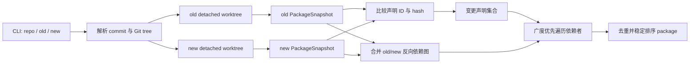

# 实现架构

[简体中文](architecture.md) · [English](architecture.en.md)

本文面向 ripples 的维护者，说明 package 影响分析如何映射到当前源码。面向使用者的检查范围和边界见[分析能力](analysis.md)，CLI、输出和缓存目录见[安装与使用](usage.md)。

## 总体流程



入口位于 [`main.go`](../main.go)，主算法是 [`internal/impact/analyzer.go`](../internal/impact/analyzer.go) 的 `AnalyzeDetailed`。

## 1. Revision 与隔离快照

[`internal/snapshot/source.go`](../internal/snapshot/source.go) 的 `Resolve` 使用 `git rev-parse --verify` 解析 commit 和 tree，并记录 module 目录相对 Git 根目录的位置。`OpenRevision` 创建临时 detached worktree，保留整个仓库的目录结构，使同仓库本地 `replace` 仍然有效。`Source.Close` 删除 worktree，清理失败会返回给调用方。

old/new revision 的解析和快照加载可以并发进行。Git worktree 元数据操作使用按 Git 根目录分组的 mutex 串行化，避免同一仓库并发执行 `worktree add/remove` 时互相干扰。如果 old/new 指向同一个 Git tree，只构建一次 package snapshot。

## 2. PackageSnapshot

核心数据结构定义在 [`internal/impact/snapshot.go`](../internal/impact/snapshot.go)：

| 类型 | 作用 |
| --- | --- |
| `PackageSnapshot` | 一棵 Git tree 的 module、package 和声明图 |
| `Package` | package 路径、名称、内容 hash 和 import 列表 |
| `Symbol` | 一个声明的稳定 ID、语义 hash、所属 package 和依赖声明 ID |

`buildPackageSnapshot` 使用 `golang.org/x/tools/go/packages` 加载 `./...`，请求本地 package 的 AST、类型信息、import、module、embed 和其他编译输入，但不请求 `NeedDeps`。标准库和第三方库因此只作为类型/import 契约，不遍历函数体。实际文件由当前 Go toolchain、`GOOS`、`GOARCH`、build tags 和 CGo 配置决定；`_test.go` 默认不加载。

解析器保留注释供编译指令和 `go:embed` 处理，同时跳过旧的 parser object resolution。完成类型检查后，会清理后续阶段不再使用的 `types.Info` 字段，降低快照构建期间的内存占用。

## 3. 声明 ID、hash 和依赖

声明图的主要实现位于 [`internal/impact/symbol.go`](../internal/impact/symbol.go)。每个本地声明都会生成稳定 ID，例如：

```text
example.com/app/payment::func::Charge
example.com/app/payment::method::Service.Pay
example.com/app/payment::field::Config.Client
example.com/app/payment::init::payment/init.go::0
```

普通声明以 package path、声明种类和名称作为身份。方法包含 receiver，`init` 使用文件路径和文件内序号区分。接口和值流分析生成的 synthetic dispatch symbol 还包含 package path 和依赖集合 hash，避免 old/new 图中不同调用链错误合并。

### 语义 hash

- 普通声明通过 `ast.Fprint` 计算 hash，过滤源码位置、普通注释和 parser 内部对象链接；常量使用完整类型和精确值。
- struct 字段和 interface 方法是独立 symbol，成员变化不会自动污染整个类型的所有使用者。
- [`internal/impact/buildmeta.go`](../internal/impact/buildmeta.go) 把 CGo preamble 和影响构建的 `//go:` 指令加入 hash。
- [`internal/impact/embed.go`](../internal/impact/embed.go) 为 `go:embed` 文件建立 content-hash symbol，并连接到对应变量。
- package hash 包含编译文件、embed/other files 和 import。声明重排或跨文件移动可能返回变更 package 本身，但不会创建不存在的跨 package 声明边。

### 声明依赖

基础依赖来自 `types.Info.Uses`：声明 AST 中引用的本地对象会转换成对应 symbol ID。随后补充三类 Go 语义关系：

1. package 初始化：有执行效果的全局变量初始化、`init` 和本地 import 初始化顺序。
2. embed/build 输入：嵌入文件、CGo preamble 和编译指令。
3. 接口与函数值：调用点、参数、返回值、字段、容器和函数值传播形成的 synthetic dispatch symbol。

依赖保存为排序后的 ID 集合，保证 snapshot 和输出稳定。

## 4. 接口与函数值精度

接口和值流逻辑集中在 [`internal/impact/symbol.go`](../internal/impact/symbol.go) 的 `valueFlowResolver` 和 `interfaceCallTracer`。resolver 沿赋值、参数、返回值、字段和容器解析候选具体类型或函数；tracer 把接口方法调用连接到这些候选实现。完整语法覆盖见[分析能力](analysis.md)。

解析以调用点和值流为边界，不会因两个类型实现同一接口就合并调用方。同一静态位置存在多个候选时会保守返回全部候选。resolving set 和 candidate key 用于终止递归函数、循环容器和互相调用；第三方调用只使用可见接口契约。

## 5. Module 与构建配置变化

package snapshot 先计算 `go.mod`、`go.sum`、`go.work` 和 `go.work.sum` 的整体 hash。只有 old/new 的该 hash 不同时，[`internal/impact/module.go`](../internal/impact/module.go) 才会额外构建 module snapshot。

module snapshot 使用 `NeedDeps`，但只收集本地 package 到第三方 module identity 和 checksum key 的映射，不解析第三方函数体。比较项包括有效的 Go/toolchain 配置、每个本地 package 实际依赖的 module/version/`replace`，以及 old/new 都存在的同一 module/version checksum。

发生变化的本地 package 会通过它的 package-init symbol 注入声明图，再使用同一套反向传播逻辑。普通 `go.sum` 缓存记录的新增或删除不会扩大影响范围。

## 6. old/new 比较与反向传播

主流程位于 [`internal/impact/analyzer.go`](../internal/impact/analyzer.go)：

1. `changedSymbols` 比较 old/new symbol ID 与 hash，得到新增、删除和修改的声明；synthetic dispatch symbol 不直接作为变更根节点。
2. `reverseDependencies` 合并 old/new 的本地声明边，方向从被依赖声明指向使用者。
3. `transitiveDependents` 从全部变更根节点执行一次 BFS；`affected` set 负责去重和避免汇聚路径重复遍历。
4. symbol 折叠成 package，并按相对路径、package 名和完整路径排序。

合并两张图是新增和删除都能正确传播的关键：删除使用 old 图中仍存在的调用边，新增使用 new 图中的调用边。只读取当前工作区或只使用其中一张图会漏掉另一侧关系。

`AnalyzeDetailed` 同时把声明边折叠成 DOT 使用的跨 package 边。

## 7. 缓存

[`internal/snapshot/cache.go`](../internal/snapshot/cache.go) 提供内容寻址 JSON 缓存，当前使用两个 namespace：

```text
package-snapshots/<key>.json
module-snapshots/<key>.json
```

分析 key 包含分析格式版本、graph kind、Git tree、module 相对目录、Go runtime version，以及 `GOOS`、`GOARCH`、`CGO_ENABLED`、`GOFLAGS`、`GOEXPERIMENT`。

缓存命中后不会创建 worktree。读取损坏或不可用的缓存会回退到重新构建；写入失败会返回错误，避免把未持久化结果误认为成功缓存。写入先创建临时文件，再通过 rename 原子提交。

改变 snapshot schema 或分析语义时，需要同时提升 `analysisVersion`；改变通用缓存编码时，需要提升 `cacheVersion`。

## 8. 并发与内存边界

[`internal/impact/concurrency.go`](../internal/impact/concurrency.go) 的 `parallelFor` 最多启动 `GOMAXPROCS` 个 worker，并按输入序号保存错误。它用于 old/new revision 和 module snapshot、package 摘要、声明 hash 与基础依赖计算。

old/new package snapshot 也并发加载。一次 snapshot 中，每个 package 和声明只建立一次；传播阶段使用共享 `affected` set，因此多个变更依赖同一个声明时不会重复遍历该声明。

内存主要通过三处约束：主 package graph 不请求第三方 `NeedDeps`，类型检查后清理不用的 `types.Info` map，持久化 snapshot 不保存完整 AST。冷分析仍需同时持有当前 module 的 AST 和必要类型信息。

## 9. 代码与测试入口

| 关注点 | 实现 | 主要测试 |
| --- | --- | --- |
| revision/worktree | [`internal/snapshot/source.go`](../internal/snapshot/source.go) | [`internal/snapshot/source_test.go`](../internal/snapshot/source_test.go) |
| 持久缓存 | [`internal/snapshot/cache.go`](../internal/snapshot/cache.go) | [`internal/snapshot/cache_test.go`](../internal/snapshot/cache_test.go) |
| package snapshot/hash | [`internal/impact/snapshot.go`](../internal/impact/snapshot.go) | [`internal/impact/snapshot_test.go`](../internal/impact/snapshot_test.go) |
| 声明、接口和值流 | [`internal/impact/symbol.go`](../internal/impact/symbol.go) | [`internal/impact/analyzer_test.go`](../internal/impact/analyzer_test.go)、[`internal/impact/interface_flow_test.go`](../internal/impact/interface_flow_test.go) |
| module/workspace | [`internal/impact/module.go`](../internal/impact/module.go) | [`internal/impact/module_test.go`](../internal/impact/module_test.go) |
| CGo/编译指令 | [`internal/impact/buildmeta.go`](../internal/impact/buildmeta.go) | [`internal/impact/buildmeta_test.go`](../internal/impact/buildmeta_test.go) |
| `go:embed` | [`internal/impact/embed.go`](../internal/impact/embed.go) | [`internal/impact/analyzer_test.go`](../internal/impact/analyzer_test.go) |
| 反向传播/package 图 | [`internal/impact/analyzer.go`](../internal/impact/analyzer.go) | [`internal/impact/analyzer_test.go`](../internal/impact/analyzer_test.go) |
| 并发 worker | [`internal/impact/concurrency.go`](../internal/impact/concurrency.go) | [`internal/impact/concurrency_test.go`](../internal/impact/concurrency_test.go) |
| 输出 | [`internal/output/reporter.go`](../internal/output/reporter.go) | [`internal/output/reporter_test.go`](../internal/output/reporter_test.go) |
