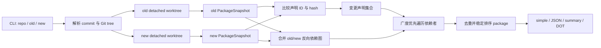

# 实现架构

[简体中文](architecture.md) · [English](architecture.en.md)

本文面向 ripples 的维护者，说明 package 影响分析如何映射到当前源码。面向使用者的检查范围和边界见[分析能力](analysis.md)，CLI、输出和缓存目录见[安装与使用](usage.md)。

## 总体流程



入口位于 [`main.go`](../main.go)。CLI 创建持久缓存和 `impact.Analyzer`，调用 `AnalyzeDetailed`，最后由 [`internal/output/reporter.go`](../internal/output/reporter.go) 格式化结果。

## 1. Revision 与隔离快照

[`internal/snapshot/source.go`](../internal/snapshot/source.go) 负责把用户输入变成不可变分析源：

1. `Resolve` 使用 `git rev-parse --verify` 分别解析 commit 和 tree。
2. 它记录 module 目录相对 Git 根目录的位置，拒绝仓库外路径。
3. `OpenRevision` 在临时目录创建 detached worktree，不切换或修改用户当前工作区。
4. worktree 保留整个仓库的相对目录结构，因此同仓库本地 `replace` 仍能找到目标目录。
5. `Source.Close` 删除 worktree 和临时目录，清理失败会返回给调用方。

old/new revision 的解析和快照加载可以并发进行。Git worktree 元数据操作使用按 Git 根目录分组的 mutex 串行化，避免同一仓库并发执行 `worktree add/remove` 时互相干扰。如果 old/new 指向同一个 Git tree，只构建一次 package snapshot。

## 2. PackageSnapshot

核心数据结构定义在 [`internal/impact/snapshot.go`](../internal/impact/snapshot.go)：

| 类型 | 作用 |
| --- | --- |
| `PackageSnapshot` | 一棵 Git tree 的 module、package 和声明图 |
| `Package` | package 路径、名称、内容 hash 和 import 列表 |
| `Symbol` | 一个声明的稳定 ID、语义 hash、所属 package 和依赖声明 ID |

`buildPackageSnapshot` 使用 `golang.org/x/tools/go/packages` 加载 `./...`。它请求当前构建需要的文件、AST、类型、类型信息、import、module、embed 和其他编译输入，但不请求 `NeedDeps`。因此：

- 当前 module 中的每个本地 package 都有完整 AST 和类型信息。
- 标准库及第三方库只保留类型和 import 契约，不遍历其函数体。
- `GOOS`、`GOARCH`、build tags、CGo 和当前 Go toolchain 会决定实际进入分析的编译文件。
- `_test.go` 默认不进入这个 package graph。

解析器保留注释供编译指令和 `go:embed` 处理，同时跳过旧的 parser object resolution。完成类型检查后，会清理后续阶段不再使用的 `types.Info` 字段，降低快照构建期间的内存占用。

## 3. 声明 ID、hash 和依赖

声明图的主要实现位于 [`internal/impact/symbol.go`](../internal/impact/symbol.go)。每个本地声明都会生成稳定 ID，例如：

```text
example.com/app/payment::func::Charge
example.com/app/payment::method::Service.Pay
example.com/app/payment::type::Config
example.com/app/payment::field::Config.Client
example.com/app/payment::interface-method::Store.Save
example.com/app/payment::var::DefaultClient
example.com/app/payment::const::RetryLimit
example.com/app/payment::init::payment/init.go::0
```

普通声明以 package path、声明种类和名称作为身份。方法包含 receiver，`init` 使用文件路径和文件内序号区分。接口和值流分析生成的 synthetic dispatch symbol 还包含 package path 和依赖集合 hash，避免 old/new 图中不同调用链错误合并。

### 语义 hash

- Go 声明通过 `ast.Fprint` 计算 hash。
- 源码位置、普通注释和 parser 内部对象链接不会进入声明 hash，因此纯格式变化或只改普通注释不会改变声明。
- 常量使用完整类型和精确值计算 hash。
- struct 字段和 interface 方法作为独立 symbol，避免修改一个成员时污染整个类型的所有使用者。
- CGo preamble 和会影响构建的 `//go:` 指令由 [`internal/impact/buildmeta.go`](../internal/impact/buildmeta.go) 单独归一化并加入 hash。
- `go:embed` 匹配到的文件由 [`internal/impact/embed.go`](../internal/impact/embed.go) 建立独立 content-hash symbol，并连接到对应变量。
- package hash 还包含编译文件、embed/other files 和 import 集合，用于识别 package 自身的内容变化；声明重排或跨文件移动仍可能让变更 package 自身进入结果，但不会凭空产生跨 package 声明依赖。

### 声明依赖

基础依赖来自 `types.Info.Uses`：声明 AST 中引用的本地对象会转换成对应 symbol ID。随后补充三类 Go 语义关系：

1. package 初始化：有执行效果的全局变量初始化、`init` 和本地 import 初始化顺序。
2. embed/build 输入：嵌入文件、CGo preamble 和编译指令。
3. 接口与函数值：调用点、参数、返回值、字段、容器和函数值传播形成的 synthetic dispatch symbol。

依赖始终保存为排序后的 ID 集合，使 snapshot、cache 和输出在并发执行时仍保持稳定。

## 4. 接口与函数值精度

接口和值流逻辑集中在 [`internal/impact/symbol.go`](../internal/impact/symbol.go) 的 `valueFlowResolver` 和 `interfaceCallTracer`。

分析器会追踪：

- 接口参数、返回值、变量和 struct 字段中的具体类型。
- 工厂、多返回值、赋值、类型断言和 type switch。
- 闭包、命名函数、函数类型转换、方法值和方法表达式。
- slice、array、map、channel、range、`append` 及静态可确定的 index/key。
- 泛型透传、variadic 参数、`go` 和 `defer` 调用。

这里的关键约束是“以调用点和值流为准”。一个接口存在多个实现时，修改实现 A 不会仅因为实现 B 也满足同一接口，就把 B 的调用方一起返回。当同一静态存储位置确实可能保存多个运行时值时，结果会保守地包含这些候选。

值流解析使用 resolving set 和稳定 candidate key 阻止递归函数、循环容器和互相调用形成无限递归。第三方函数体不参与分析；本地值传给第三方接口时，只沿可见的接口方法契约传播。

## 5. Module 与构建配置变化

package snapshot 先计算 `go.mod`、`go.sum`、`go.work` 和 `go.work.sum` 的整体 hash。只有 old/new 的该 hash 不同时，[`internal/impact/module.go`](../internal/impact/module.go) 才会额外构建 module snapshot。

module snapshot 使用 `NeedDeps`，但只收集 package 到第三方 module identity 和 checksum key 的映射，不解析第三方函数体。它比较：

- module path、Go version、toolchain 和 `godebug` 等有效全局配置。
- 每个本地 package 实际传递依赖的 module path、version 和 `replace`。
- old/new 都存在的同一 module/version checksum 是否变化。

发生变化的本地 package 会通过它的 package-init symbol 注入声明图，再使用同一套反向传播逻辑。普通 `go.sum` 缓存记录的新增或删除不会扩大影响范围。

## 6. old/new 比较与反向传播

主流程位于 [`internal/impact/analyzer.go`](../internal/impact/analyzer.go)：

1. `changedSymbols` 取 old/new symbol ID 并集。
2. ID 只存在于一侧，表示新增或删除；两侧 hash 不同，表示修改。
3. synthetic dispatch symbol 不直接作为变更根节点，它们只承载更精确的传播路径。
4. `reverseDependencies` 合并 old/new 的本地声明边，方向从“被依赖声明”指向“使用它的声明”。
5. `transitiveDependents` 从全部变更根节点执行一次 BFS。
6. `affected` set 既负责结果去重，也保证多项变更汇聚到同一声明时只分析一次。
7. symbol 最终折叠成 package，并按相对路径、package 名和完整路径稳定排序。

合并两张图是新增和删除都能正确传播的关键：删除使用 old 图中仍存在的调用边，新增使用 new 图中的调用边。只读取当前工作区或只使用其中一张图会漏掉另一侧关系。

`AnalyzeDetailed` 还会把声明边折叠成 package 边，供 DOT 输出展示；同一 package 内部的声明边不会画到 package 图中。

## 7. 缓存

[`internal/snapshot/cache.go`](../internal/snapshot/cache.go) 提供内容寻址 JSON 缓存，当前使用两个 namespace：

```text
package-snapshots/<key>.json
module-snapshots/<key>.json
```

分析 key 由以下内容组成：

- 分析格式版本和 graph kind。
- Git tree 和 module 在仓库中的相对目录。
- Go runtime version。
- `GOOS`、`GOARCH`、`CGO_ENABLED`、`GOFLAGS` 和 `GOEXPERIMENT`。

缓存命中后不会创建 worktree。读取损坏或不可用的缓存会回退到重新构建；写入失败会返回错误，避免把未持久化结果误认为成功缓存。写入先创建临时文件，再通过 rename 原子提交。

改变 snapshot schema 或分析语义时，需要同时提升 `analysisVersion`；改变通用缓存编码时，需要提升 `cacheVersion`。

## 8. 并发与内存边界

[`internal/impact/concurrency.go`](../internal/impact/concurrency.go) 的 `parallelFor` 最多启动 `GOMAXPROCS` 个 worker，并按输入序号保存错误，保证并发不会改变错误顺序。它用于：

- old/new revision 解析和 module snapshot 加载。
- package 摘要计算。
- 声明 hash 与基础依赖计算。

old/new package snapshot 也并发加载。一次 snapshot 中，每个 package 和声明只建立一次；传播阶段使用共享 `affected` set，因此多个变更依赖同一个声明时不会重复遍历该声明。

内存边界主要由三项控制：主 package graph 不请求第三方 `NeedDeps`、类型检查后清理不用的 `types.Info` map、snapshot 完成后只持久化 package/symbol 摘要而不缓存完整 AST。构建 snapshot 时仍需同时持有当前 module 的 AST 和必要类型信息，这部分是冷分析的主要内存成本。

## 9. 输出层

[`internal/output/reporter.go`](../internal/output/reporter.go) 不参与影响计算，只消费 `Analysis`：

- `simple`：每行一个 `<relative path>.<package name>`。
- `json`：只暴露相对路径和 package 名。
- `text` / `summary`：输出数量和列表。
- `dot`：使用 `github.com/emicklei/dot` 生成 package 级反向关系图。

binary、service、label 和部署单元映射不进入核心分析器，调用方可以基于稳定 package 输出封装。

## 10. 代码与测试入口

| 关注点 | 实现 | 主要测试 |
| --- | --- | --- |
| revision/worktree | [`internal/snapshot/source.go`](../internal/snapshot/source.go) | [`internal/snapshot/source_test.go`](../internal/snapshot/source_test.go) |
| 持久缓存 | [`internal/snapshot/cache.go`](../internal/snapshot/cache.go) | [`internal/snapshot/cache_test.go`](../internal/snapshot/cache_test.go) |
| package snapshot/hash | [`internal/impact/snapshot.go`](../internal/impact/snapshot.go) | [`internal/impact/snapshot_test.go`](../internal/impact/snapshot_test.go) |
| 声明、接口和值流 | [`internal/impact/symbol.go`](../internal/impact/symbol.go) | [`internal/impact/analyzer_test.go`](../internal/impact/analyzer_test.go)、[`internal/impact/interface_flow_test.go`](../internal/impact/interface_flow_test.go) |
| module/workspace | [`internal/impact/module.go`](../internal/impact/module.go) | [`internal/impact/module_test.go`](../internal/impact/module_test.go) |
| CGo/编译指令 | [`internal/impact/buildmeta.go`](../internal/impact/buildmeta.go) | [`internal/impact/buildmeta_test.go`](../internal/impact/buildmeta_test.go) |
| `go:embed` | [`internal/impact/embed.go`](../internal/impact/embed.go) | [`internal/impact/analyzer_test.go`](../internal/impact/analyzer_test.go) |
| 反向传播/package 图 | [`internal/impact/analyzer.go`](../internal/impact/analyzer.go) | [`internal/impact/analyzer_test.go`](../internal/impact/analyzer_test.go) |
| 并发 worker | [`internal/impact/concurrency.go`](../internal/impact/concurrency.go) | [`internal/impact/concurrency_test.go`](../internal/impact/concurrency_test.go) |
| 输出 | [`internal/output/reporter.go`](../internal/output/reporter.go) | [`internal/output/reporter_test.go`](../internal/output/reporter_test.go) |

新增分析能力时，应同时回答三个问题：变更内容如何形成稳定 symbol hash、实际使用关系如何形成 dependency edge、old/new 两侧是否都能通过回归测试覆盖。
