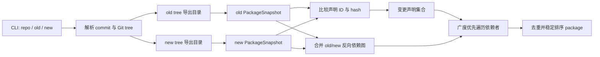

# 实现架构

[简体中文](architecture.md) · [English](architecture.en.md)

本文面向 ripples 的维护者，说明 package 影响分析如何映射到当前源码。面向使用者的检查范围和边界见[分析能力](analysis.md)，CLI、输出和缓存目录见[安装与使用](usage.md)。

## 总体流程


```mermaid
flowchart LR
    CLI["CLI: repo / old / new"] --> Resolve["解析 commit 与 Git tree"]
    Resolve --> Old["old tree 导出目录"]
    Resolve --> New["new tree 导出目录"]
    Old --> OldSnapshot["old PackageSnapshot"]
    New --> NewSnapshot["new PackageSnapshot"]
    OldSnapshot --> Compare["比较声明 ID 与 hash"]
    NewSnapshot --> Compare
    Compare --> Changed["变更声明集合"]
    OldSnapshot --> Reverse["合并 old/new 反向依赖图"]
    NewSnapshot --> Reverse
    Changed --> Walk["广度优先遍历依赖者"]
    Reverse --> Walk
    Walk --> Packages["去重并稳定排序 package"]
```

入口位于 [`main.go`](../main.go)，主算法是 [`internal/impact/analyzer.go`](../internal/impact/analyzer.go) 的 `AnalyzeDetailed`。CLI 使用 `signal.NotifyContext`，Ctrl-C 或 CI 取消时通过 context 停止 git/go 子进程并删除临时目录。

## 1. Revision 与隔离导出

[`internal/snapshot/source.go`](../internal/snapshot/source.go) 的 `Resolve` 使用 `git rev-parse --verify` 解析 commit 和 tree，并记录 module 目录相对 Git 根目录的位置。`OpenRevision` 用 `GIT_INDEX_FILE` 指向的私有 index 执行 `git read-tree` 和 `git checkout-index --all --prefix`，把完整 tree 导出到临时目录：

- 不注册 worktree，也不修改仓库自己的 index，因此进程被中断时不会在 `.git` 中留下记录。
- `checkout-index` 不触发 hook。
- `-c core.sparseCheckout=false` 保证即使用户仓库启用了 sparse-checkout，导出的仍是整棵 tree。
- `GIT_LFS_SKIP_SMUDGE=1` 让 LFS 文件保持 pointer，分析不需要下载 LFS 内容。

导出保留整个仓库的目录结构，使同仓库本地 `replace` 和父目录中的 `go.work` 仍然有效。每次导出使用独立 index，old/new 可以并发导出。`Source.Close` 删除临时目录。如果 old/new 指向同一个 Git tree，只构建一次 package snapshot。

## 2. PackageSnapshot

核心数据结构定义在 [`internal/impact/snapshot.go`](../internal/impact/snapshot.go)：

| 类型 | 作用 |
| --- | --- |
| `PackageSnapshot` | 一棵 Git tree 的 module 信息、package 和声明图 |
| `Package` | package 路径、名称和内容 hash；分析结果中额外标记被删除的 package |
| `Symbol` | 一个声明的稳定 ID、语义 hash、所属 package 和依赖声明 ID |

`buildPackageSnapshot` 先执行可选的 `-prepare` 命令，再使用 `golang.org/x/tools/go/packages` 加载 `./...`，请求本地 package 的 AST、类型信息、import、module、embed 和其他编译输入，但不请求 `NeedDeps`。标准库和第三方库因此只作为类型/import 契约，不遍历函数体。实际文件由当前 Go toolchain、`GOOS`、`GOARCH`、build tags 和 CGo 配置决定。

只有指定 `-tests` 时才设置 `Tests: true`。默认结果用于构建和部署，不需要测试文件；测试文件往往比非测试代码更多，加载它们会让冷分析明显变慢。`-tests` 进入缓存 key，两种模式的 snapshot 互不复用。

go/packages 会让 `go list -export` 为所有列出的 package 编译 export data，包括随后从源码类型检查的本地 package。加载时传入 `-trimpath`：否则 Go 构建缓存的 key 含 package 目录，而每次导出的临时目录都不同，每次分析都会重编整个 module 并写入新的缓存条目；加上后未变化的 package 在不同运行、不同 tree 之间都能命中构建缓存。`-trimpath` 只改变 cgo 生成文件 `//line` 中记录的路径（变为 module 路径形式），这些路径在不同导出之间同样稳定。

测试加载会返回同一 package 的多个变体：普通 package `p`、包含 `_test.go` 的 `p [p.test]`、外部测试 package `p_test [p.test]`，以及为测试重新编译的依赖 `q [p.test]`。生成的测试 main 被丢弃，其余变体全部参与分析：

- `reportPath` 把内部测试变体和外部测试 package 归到被测 package，重新编译的依赖保留自己的路径。
- 同一声明在各变体中得到相同 ID，合并为一个 symbol；各变体的类型对象都会登记，外部测试引用的对象也能解析。
- 同一个 package 的各变体合并为一个 `Package`，hash 覆盖全部变体，名称取自普通 package。

解析器保留注释供编译指令和 `go:embed` 处理，同时跳过旧的 parser object resolution。

## 3. 声明 ID、hash 和依赖

声明图的主要实现位于 [`internal/impact/symbol.go`](../internal/impact/symbol.go)。每个本地声明都会生成稳定 ID，例如：

```text
example.com/app/payment::func::Charge
example.com/app/payment::method::Service.Pay
example.com/app/payment::field::Config.Client
example.com/app/payment::init::payment/init.go::0
```

普通声明以 package path、声明种类和名称作为身份。方法包含 receiver，`init` 和空白初始化器使用文件路径和文件内序号区分，使普通 package 和测试变体中的同一声明得到相同 ID。cgo 处理过的文件按 line directive 使用原始文件名。

### 语义 hash

- 普通声明通过 `ast.Fprint` 计算 hash，过滤源码位置、普通注释和 parser 内部对象链接；常量使用完整类型和精确值。
- struct 字段和 interface 方法是独立 symbol，成员变化不会自动污染整个类型的所有使用者。
- [`internal/impact/buildmeta.go`](../internal/impact/buildmeta.go) 把 CGo preamble 和影响构建的 `//go:` 指令加入 hash。
- [`internal/impact/embed.go`](../internal/impact/embed.go) 为 `go:embed` 文件建立 content-hash symbol，并连接到对应变量。
- 每个有非 Go 源文件（汇编、C/C++、头文件、syso）的 package 有一个输入 symbol，hash 覆盖这些文件的路径和内容。
- package hash 包含编译文件、embed/other files 和 import。声明重排或跨文件移动可能返回变更 package 本身，但不会创建不存在的跨 package 声明边。

### 声明依赖

基础依赖来自 `types.Info`，由 `addReferenceDependencies` 在一次 AST 遍历中收集：

- `Uses` 引用的本地对象。实例化泛型的方法和字段通过 `Origin()` 映射回泛型声明。
- `Selections` 的 index 路径上的嵌入字段，使替换嵌入类型能传播到提升出来的字段和方法的使用者。
- 无键 struct 字面量依赖该类型的 layout symbol。
- 调用泛型函数（`Instances` 中对象为函数）或选择泛型类型实例的方法时，类型实参的契约。只写出实例化类型不执行泛型代码，不产生这项依赖。

随后补充以下 Go 语义关系：

1. package 初始化：每个 package 变体一个 package-init symbol，ID 使用 package ID。它依赖该变体自己文件中的 `init`、有运行时副作用的命名及空白变量初始化，以及本地 import 的 package-init，因此测试文件的 `init` 不会传播到普通 package 的导入方。`types.Info` 用于区分函数调用和类型转换；转换参数仍继续遍历，slice 到非空 array 或 array pointer 的转换因可能在运行时 panic 而保留初始化依赖。该判断是语法级效果模型，不推断依赖运行时值的所有 panic 条件。
2. embed/build 输入：嵌入文件、CGo preamble、编译指令；没有 Go 函数体的声明和 cgo 处理过的文件中的声明依赖 package 的非 Go 输入 symbol。
3. 类型契约与接口转换：见下一节。

依赖保存为排序后的 ID 集合，保证 snapshot 和输出稳定。

## 4. 类型契约与接口转换

实现位于 [`internal/impact/contract.go`](../internal/impact/contract.go)，选择这一方案而不是自研值流或 VTA 的理由见 [ADR-0001](adr/0001-interface-conversion-contracts.md)。

每个 package 级命名非接口类型有三个 synthetic symbol：

- layout：hash 为 `types.TypeString(底层类型)`，覆盖字段顺序、类型和 tag。
- contract：依赖 layout、`*T` 方法集中的全部方法（含经嵌入提升的方法），以及字段和元素中本地命名类型的 contract。
- dispatch：依赖 layout、`*T` 方法集中在任意位置可能被动态调用的方法，以及字段和元素中本地命名类型的 dispatch；只由本地代码经接口调用的方法记录在 `Symbol.Dynamic` 中，作为带调用方声明的条件依赖。

`collectDynamicMethods` 遍历每个本地声明的语法树，按方法 ID 收集可以发起动态调用的接口：`TypesInfo.Uses` 中接收者为接口的方法（只记被调用的那个方法，并记下发起调用的声明作为调用方）、类型断言和 type switch 中接口的全部方法；另外收集传递依赖 package scope 中接口类型的全部方法，以及 `error`。`*T` 的方法 m 匹配某个记录的接口 J，当且仅当 J 含 m、签名 `types.Identical` 且 `types.Implements(*T, J)`；泛型类型的方法和提及类型参数的接口按名称匹配，因为实例化前无法判断实现关系。匹配的记录中只要有一条没有调用方（类型断言、依赖库接口），或方法名是 `Unwrap`、`Is`、`As`、`Timeout`、`Temporary`（标准库用匿名接口检查它们），m 就是 dispatch 的普通依赖；否则把全部调用方声明记为条件依赖。设计取舍见 [ADR-0002](adr/0002-dispatch-contracts.md)。

`addConversionDependencies` 用官方 `golang.org/x/tools/go/ssa` 为本地 package 构建 SSA；依赖只从 export data 为本地 package 的直接 import 创建类型包（间接依赖的方法由 SSA 按需创建），不构建函数体。本地 package 按 package 并发构建，每个 package 构建后立即扫描并清空其函数体，同一时刻只有正在处理的 package 的 SSA 函数体在内存中。SSA 把所有隐式转换显式化为 `MakeInterface`：

- 普通函数和方法（含闭包）中的转换，归到所在的声明。
- package 变量初始化器被编译进合成的 package initializer。转换先按写入的全局变量归属；没有写入时，按消费该值的指令位置落到对应初始化器的源码范围；都定位不到时，归到 package-init（保守）。

执行转换的声明依赖被转换类型（及其复合类型、类型实参中的本地命名类型）的契约：目标是空接口或实现了 `error` 的接口时用 contract，其他接口用 dispatch。这样不需要值流追踪：无论接口值之后流向哪里（setter、functional options、注册表、嵌入字段、`fmt`/`encoding/json` 等外部参数），影响都能从转换点传播，分析时间与代码规模线性相关。条件依赖在反向传播时按 package 汇合处理，见下一节。

## 5. Module 与构建配置变化

module 信息在构建 package snapshot 的同一次导出中计算，保证 package 图和 module 图描述同一个 Git tree。[`internal/impact/module.go`](../internal/impact/module.go) 使用 `NeedDeps` 加载元数据，只收集本地 package 到第三方 module identity 和 checksum key 的映射，不解析第三方函数体。

- `go env GOWORK` 在导出的 module 目录中定位实际生效的 go.work，它可能位于父目录或来自 `GOWORK`。
- 有效配置 hash 使用 module 的 go.mod 和该 go.work 中的 go/toolchain/godebug。
- checksum 读取 module 的 go.sum，以及 workspace 的 go.work.sum 和每个 use module 的 go.sum。

比较项包括有效的 Go/toolchain 配置、每个本地 package 实际依赖的 module/version/`replace`，以及 old/new 都存在的同一 module/version checksum。发生变化的本地 package 会通过它的 package-init symbol 注入声明图，再使用同一套反向传播逻辑。普通 `go.sum` 缓存记录的新增或删除不会扩大影响范围。

## 6. old/new 比较与反向传播

主流程位于 [`internal/impact/analyzer.go`](../internal/impact/analyzer.go)：

1. `changedSymbols` 比较 old/new symbol ID 与 hash，得到新增、删除和修改的声明。
2. `reverseDependencies` 合并 old/new 的本地声明边，方向从被依赖声明指向使用者。
3. `transitiveDependents` 从全部变更根节点沿普通边传播；`affected` set 负责去重和避免汇聚路径重复遍历。某个受影响的声明是条件依赖的目标方法时，计算两个反向闭包（条件依赖按普通边计入，属于保守近似）：到达该 dispatch symbol 的声明（转换侧），以及调用方声明本身和到达它们的声明（调用侧）。只有同时出现在两侧 package 集合中的 package，其中属于任一侧的声明才被标记为受影响；这些声明不再沿普通边扩散，因为它们的使用者只有在自己的 package 也汇合时才会运行该方法。按 package 而不是按声明汇合，是因为包初始化和 `main` 是同一 binary 中互不引用的声明。闭包按起点缓存。
4. symbol 折叠成 package，并按相对路径、package 名和完整路径排序；只存在于 old 的 package 标记为 `Deleted`。

合并两张图是新增和删除都能正确传播的关键：删除使用 old 图中仍存在的调用边，新增使用 new 图中的调用边。只读取当前工作区或只使用其中一张图会漏掉另一侧关系。

`AnalyzeDetailed` 同时把声明边折叠成 DOT 使用的跨 package 边；经条件依赖标记的声明挂在触发它的方法下，保持关系图连通。

## 7. 缓存

[`internal/snapshot/cache.go`](../internal/snapshot/cache.go) 提供内容寻址、gzip 压缩的 JSON 缓存。每棵 tree 的 snapshot 拆成清单和分块：`snapshots/<key>.json.gz` 只记录 tree、module 路径和分块 key；`snapshot-chunks/<内容 hash>.json.gz` 每个 package 一块（package 信息、该 package 的 module 依赖和全部 symbol），module checksum 单独一块。分块以内容 hash 为 key，不同 tree 中未变化的 package 共用同一块，缓存一个新提交只新增它改动的 package 的分块。读取时任一分块缺失都按未命中处理并重新构建。

分析 key 包含分析格式版本、graph kind、Git tree、module 相对目录、编译 ripples 的 Go 版本、`go env -json` 报告的实际生效构建配置（在任何 module 之外执行，因此包含环境变量和 `go env -w` 的设置），以及 `-prepare` 命令和 `-tests`。

缓存命中后不会导出 tree，并刷新条目的修改时间。每次分析结束后 `Prune` 先删除 7 天内没有读写的条目；总大小仍超过 `MaxBytes`（默认 1024 MB，`RIPPLES_CACHE_MAX_MB` 覆盖）时，按修改时间从旧到新删除，直到不超过上限。读取损坏或不可用的缓存会回退到重新构建；写入失败会返回错误，避免把未持久化结果误认为成功缓存。写入先创建临时文件，再通过 rename 原子提交。

改变 snapshot schema 或分析语义时，需要同时提升 `analysisVersion`；改变通用缓存编码时，需要提升 `cacheVersion`。

## 8. 并发与内存边界

[`internal/impact/concurrency.go`](../internal/impact/concurrency.go) 的 `parallelFor` 最多启动 `GOMAXPROCS` 个 worker，并按输入序号保存错误。它用于解析 old/new revision、package 摘要、声明 hash 与基础依赖计算，以及逐 package 构建和扫描 SSA。

old/new package snapshot 依次加载：构建一个 snapshot 已经会用满所有 CPU，同时构建两个只会让峰值内存翻倍；缓存命中很快，顺序加载几乎没有代价。一次 snapshot 中，每个声明只建立一次；传播阶段使用共享 `affected` set，因此多个变更依赖同一个声明时不会重复遍历该声明。

主 package graph 不请求第三方 `NeedDeps`，持久化 snapshot 不保存 AST 或 SSA。冷分析的内存峰值来自同时持有当前 module（指定 `-tests` 时含测试变体）的 AST、`types.Info` 和依赖的类型信息；SSA 的 `Function` 会一直引用自己的语法节点和所在 package 的 `types.Info`，所以这些数据在扫描结束前无法提前释放。约 3000 个 Go 文件的 module 冷分析时存活堆约 400–500 MB。

## 9. 代码与测试入口

| 关注点 | 实现 | 主要测试 |
| --- | --- | --- |
| revision/导出 | [`internal/snapshot/source.go`](../internal/snapshot/source.go) | [`internal/snapshot/source_test.go`](../internal/snapshot/source_test.go) |
| 持久缓存 | [`internal/snapshot/cache.go`](../internal/snapshot/cache.go) | [`internal/snapshot/cache_test.go`](../internal/snapshot/cache_test.go) |
| package snapshot/hash/测试变体 | [`internal/impact/snapshot.go`](../internal/impact/snapshot.go) | [`internal/impact/snapshot_test.go`](../internal/impact/snapshot_test.go)、[`internal/impact/analyzer_test.go`](../internal/impact/analyzer_test.go) |
| 声明与依赖 | [`internal/impact/symbol.go`](../internal/impact/symbol.go) | [`internal/impact/analyzer_test.go`](../internal/impact/analyzer_test.go) |
| 类型契约与接口转换 | [`internal/impact/contract.go`](../internal/impact/contract.go) | [`internal/impact/interface_flow_test.go`](../internal/impact/interface_flow_test.go) |
| module/workspace | [`internal/impact/module.go`](../internal/impact/module.go) | [`internal/impact/module_test.go`](../internal/impact/module_test.go) |
| CGo/编译指令 | [`internal/impact/buildmeta.go`](../internal/impact/buildmeta.go) | [`internal/impact/buildmeta_test.go`](../internal/impact/buildmeta_test.go) |
| `go:embed` | [`internal/impact/embed.go`](../internal/impact/embed.go) | [`internal/impact/analyzer_test.go`](../internal/impact/analyzer_test.go) |
| 反向传播/package 图 | [`internal/impact/analyzer.go`](../internal/impact/analyzer.go) | [`internal/impact/analyzer_test.go`](../internal/impact/analyzer_test.go) |
| 并发 worker | [`internal/impact/concurrency.go`](../internal/impact/concurrency.go) | [`internal/impact/concurrency_test.go`](../internal/impact/concurrency_test.go) |
| 输出 | [`internal/output/reporter.go`](../internal/output/reporter.go) | [`internal/output/reporter_test.go`](../internal/output/reporter_test.go) |
